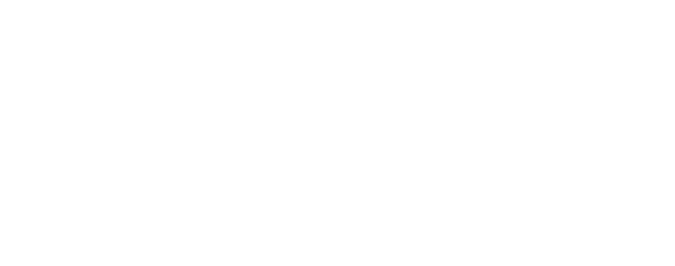

# Autocorrelation

Code: [`chronoscopelab/analysis/autocorrelation.py`](../../data-pipeline/chronoscopelab/analysis/autocorrelation.py)
· Tests: [`tests/test_analysis_autocorrelation.py`](../../tests/test_analysis_autocorrelation.py)

## What autocorrelation is

Autocorrelation is the correlation of a series with a lagged copy of itself. For a stationary series with
mean $\mu$ and autocovariance $\gamma_k = \mathbb{E}[(y_t - \mu)(y_{t-k} - \mu)]$, the autocorrelation at lag
$k$ is

$$r_k = \frac{\gamma_k}{\gamma_0}, \qquad \gamma_0 = \operatorname{Var}(y_t).$$

It quantifies how strongly today's value remembers yesterday's. A slow decay means long memory (a trend or
a unit root); a sharp periodic spike means seasonality; everything inside a narrow band means the series is
behaving like white noise. Reading the ACF and its partial cousin is the Box-Jenkins identification step that
picks the orders $p, q$ of an ARMA model.

## ACF and PACF

The **ACF** $r_k$ mixes direct and indirect dependence: $r_2$ is inflated by the chain $y_t \to y_{t-1} \to
y_{t-2}$. The **PACF** removes the intermediate lags, giving the *partial* correlation of $y_t$ and $y_{t-k}$
after regressing out $y_{t-1}, \ldots, y_{t-k+1}$. ChronoScope computes the PACF by the **Durbin-Levinson
recursion** (`method='ld'`), the standard algorithm that inverts the Yule-Walker system in $O(p^2)$:

$$\phi_{kk} = \frac{\rho_k - \sum_{j=1}^{k-1} \phi_{k-1,j}\,\rho_{k-j}}{1 - \sum_{j=1}^{k-1} \phi_{k-1,j}\,\rho_j}.$$

Under the null that the series is white noise, each $r_k$ is approximately $N(0, 1/n)$, so the 95% significance
band is $\pm 1.96/\sqrt{n}$ (Bartlett's approximation; wider and variance-dependent under a moving-average
process). Lags whose value escapes the band are the "spikes" a reader marks.

## Reading them together: AR, MA, ARMA, or white noise

The shapes of the two correlograms identify the model family (Box-Jenkins-Reinsel-Ljung 2015):

- **AR(p):** ACF tails off (geometric decay), PACF **cuts off** after lag $p$.
- **MA(q):** ACF **cuts off** after lag $q$, PACF tails off.
- **ARMA(p,q):** both tail off; pick $p, q$ by AIC over a small grid.
- **White noise:** every lag inside the band; no model to identify.

The `_identify` helper gives a conservative textual reading of this kind (a hint, not a fitted model).

## Quantifying "is there any structure at all?": the portmanteau tests

**Ljung-Box** aggregates the first $m$ autocorrelations into one statistic,

$$Q = n(n+2) \sum_{k=1}^{m} \frac{r_k^2}{n-k} \;\sim\; \chi^2_{m - d},$$

where $d$ is the number of ARMA parameters already fitted (so the test run on *residuals* is not biased
toward significance). A small p-value rejects "the first $m$ autocorrelations are jointly zero" - the series
(or the residuals) are **not** white noise. **Box-Pierce** is the older $Q^\ast = n \sum r_k^2$ form; Ljung-Box
is its small-sample refinement. When run on a fitted model's residuals, Ljung-Box is the standard
"are the errors white noise?" goodness-of-fit check.

## First-order serial correlation: Durbin-Watson

For (regression) residuals, the Durbin-Watson statistic tests first-order serial correlation,

$$DW = \frac{\sum_{t=2}^{n} (e_t - e_{t-1})^2}{\sum_{t=1}^{n} e_t^2} \approx 2(1 - \hat\rho_1).$$

$DW \approx 2$ means no first-order serial correlation; $DW < 2$ positive serial correlation; $DW > 2$
negative. It is a quick residual diagnostic; Ljung-Box is the more general joint check.

## The lag plot

A scatter of $y_t$ against $y_{t-k}$: a tight linear band signals AR(1)-style dependence, a circular cloud
signals white noise, curved shapes signal nonlinearity, and isolated off-diagonal points flag outliers
(NIST/SEMATECH e-Handbook §1.3.3.15). `lag_plot_pairs` returns the pairs directly so the web can render them.

## What this is, and is NOT

- It characterises *linear* dependence on the series' own past and identifies the ARMA family by shape.
- It is **not** a stationarity verdict (use the [stationarity](stationarity.md) tests), and not a nonlinearity
  test (use the fractal/chaos pages). A series can be stationary with rich autocorrelation, or non-stationary
  with a misleadingly clean correlogram.
- The Bartlett band assumes approximate independence; for strongly dependent series it under-covers. Treat a
  single borderline spike as weak evidence; the Ljung-Box joint test is the authoritative "is there structure"
  verdict.

## Implementation notes

- ACF via `statsmodels.tsa.stattools.acf` (FFT-based); PACF via `pacf(method='ld')` (Durbin-Levinson).
  Ljung-Box / Box-Pierce via `acorr_ljungbox` (with `model_df` for residual diagnostics); Durbin-Watson via
  `statsmodels.stats.stattools.durbin_watson`. Inputs are coerced to finite 1-D arrays.
- `autocorrelation_report(x)` runs the whole panel and returns a JSON-ready dict (ACF/PACF arrays, the
  Bartlett band, the significant lags, both portmanteau tests, Durbin-Watson, and an identification hint);
  this is what the pipeline bakes per case and the web renders as the correlogram panel.

## References

- Box, G.E.P., Jenkins, G.M., Reinsel, G.C. & Ljung, G.M. (2015). *Time Series Analysis: Forecasting and Control*, 5th ed., Wiley. ISBN 978-1-118-67502-1.
- Ljung, G.M. & Box, G.E.P. (1978). On a measure of lack of fit in time series models. *Biometrika* 65(2):297-303. DOI [10.1093/biomet/65.2.297](https://doi.org/10.1093/biomet/65.2.297).
- Box, G.E.P. & Pierce, D.A. (1970). Distribution of residual autocorrelations in autoregressive-integrated moving average time series models. *JASA* 65(332):1509-1526. DOI [10.2307/2284333](https://doi.org/10.2307/2284333).
- Durbin, J. & Watson, G.S. (1950). Testing for serial correlation in least squares regression: I. *Biometrika* 37(3-4):409-428. DOI [10.1093/biomet/37.3-4.409](https://doi.org/10.1093/biomet/37.3-4.409).
- NIST/SEMATECH e-Handbook of Statistical Methods, §1.3.3.15 Lag Plot. <https://www.itl.nist.gov/div898/handbook/eda/section3/lagplot.htm>.
