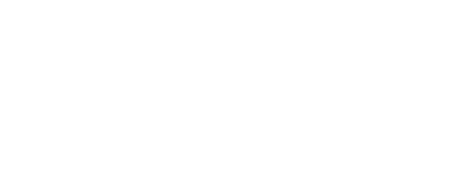

# Cross-series: correlation, causality, cointegration

Code: [`chronoscopelab/analysis/causality.py`](../../data-pipeline/chronoscopelab/analysis/causality.py)
· Tests: [`tests/test_analysis_causality.py`](../../tests/test_analysis_causality.py)

## Relating two series

The single-series diagnostics ask "what is this series?"; this unit asks "how do two series relate?" - the
foundation for the covariate and multivariate forecasting cases. Three questions:

1. **Which one leads?** - the cross-correlation function.
2. **Does the past of one improve forecasts of the other?** - Granger causality.
3. **Do two nonstationary series share a long-run equilibrium?** - cointegration.

## Cross-correlation: the lead/lag detector

The cross-correlation function is the correlation of $x_t$ with a shifted $y$,

$$\rho_{xy}(k) = \frac{\sum_t (x_t - \bar x)(y_{t+k} - \bar y)}{\sqrt{\sum_t (x_t - \bar x)^2}\sqrt{\sum_t (y_t - \bar y)^2}} ,$$

over signed lags $k$. A peak at $k > 0$ means a future value of $y$ correlates with the present of $x$ -
$x$ **leads** $y$; at $k < 0$, $y$ leads $x$. ChronoScope computes it directly on shifted overlaps so the
lead/lag sign is unambiguous, with the $\pm 1.96/\sqrt{n}$ significance band.

## Granger causality: predictive precedence

$x$ **Granger-causes** $y$ if the past of $x$ improves a forecast of $y$ beyond $y$'s own past. Formally,
compare the restricted and unrestricted regressions

$$y_t = \sum_{i=1}^{p} \alpha_i y_{t-i} + \varepsilon_t \quad\text{vs}\quad y_t = \sum_{i=1}^{p} \alpha_i y_{t-i} + \sum_{i=1}^{p} \beta_i x_{t-i} + \eta_t ,$$

with an F-test of $H_0: \beta_1 = \cdots = \beta_p = 0$. A small p-value rejects "$x$ does not help" (Granger
1969, DOI [10.2307/1912791](https://doi.org/10.2307/1912791)). ChronoScope tests **both** directions
($x \to y$ and $y \to x$) and reports the best lag per direction. Crucial caveat: **this is predictability,
not mechanism** - a common driver or a confounder produces Granger causality with no causal link, and a truly
causal effect faster than the sampling interval can be missed.

## Cointegration: a stationary spread between nonstationary series

Two series can each be a random walk (individually unforecastable, unit roots) yet move together so their
**spread is stationary** - they are **cointegrated**, sharing a long-run equilibrium. This is powerful for
forecasting: a joint error-correction (VECM) model forecasts the mean-reverting spread even when neither level
can be forecast. Two tests:

- **Engle-Granger** (1987, DOI [10.2307/1913236](https://doi.org/10.2307/1913236)): regress one series on the
  other and ADF-test the residuals for a unit root; a stationary residual means one cointegrating vector.
- **Johansen** (1991, DOI [10.2307/2938278](https://doi.org/10.2307/2938278)): a VECM rank test (trace and
  max-eigenvalue statistics) that finds *multiple* cointegrating relations simultaneously.

**Precondition (enforced):** cointegration is only meaningful when both series are $I(1)$ (unit-root
nonstationary). ChronoScope ADF-checks each series on levels and first differences and marks the verdict
`valid` only when both are genuinely $I(1)$ - on already-stationary series, "cointegration" is a category
error, and the report says so.

## What this is, and is NOT

- CCF and Granger detect *linear* lead/lag; a nonlinear coupling can be missed - corroborate with the
  [nonlinear-dynamics](nonlinear.md) DCCA and the fractal cross-correlation.
- Granger causality is directional predictability under the chosen lag order and sampling rate; it is not a
  proof of cause, and it is sensitive to omitted common drivers.
- A significant cointegration test on non-$I(1)$ series is spurious; the `valid` flag exists to prevent that
  misread.

## Implementation notes

- CCF implemented directly (explicit sign convention); Granger via
  `statsmodels.tsa.stattools.grangercausalitytests` (SSR F-test); Engle-Granger via
  `statsmodels.tsa.stattools.coint`; Johansen via `statsmodels.tsa.vector_ar.vecm.coint_johansen`; the $I(1)$
  precondition via ADF on levels and differences. Pairs are aligned to the shorter length and non-finite rows
  dropped.
- `causality_report(x, y)` bakes: the CCF peak lag + lead verdict, bidirectional Granger (causes/best-lag/
  p-value each way), and cointegration (Engle-Granger p-value, Johansen rank, the $I(1)$ precondition and the
  resulting `valid` flag).

## References

- Granger, C.W.J. (1969). Investigating Causal Relations by Econometric Models and Cross-spectral Methods. *Econometrica* 37(3):424-438. DOI [10.2307/1912791](https://doi.org/10.2307/1912791).
- Engle, R.F. & Granger, C.W.J. (1987). Co-integration and Error Correction: Representation, Estimation, and Testing. *Econometrica* 55(2):251-276. DOI [10.2307/1913236](https://doi.org/10.2307/1913236).
- Johansen, S. (1991). Estimation and Hypothesis Testing of Cointegration Vectors in Gaussian Vector Autoregressive Models. *Econometrica* 59(6):1551-1580. DOI [10.2307/2938278](https://doi.org/10.2307/2938278).
