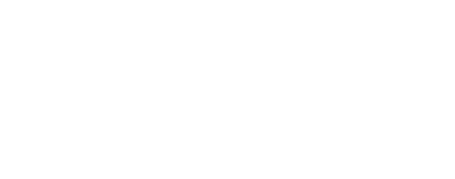

# Fractal, multifractal, and long-memory analysis

Code: [`chronoscopelab/analysis/fractal.py`](../../data-pipeline/chronoscopelab/analysis/fractal.py)
· Tests: [`tests/test_analysis_fractal.py`](../../tests/test_analysis_fractal.py)

## Self-affinity, memory, and roughness

Some series look statistically similar at every zoom level: they are **self-affine**. This unit measures that
scaling structure and turns it into a forecastability signal:

- **Long-range dependence** (the Hurst exponent): does the series remember its distant past?
- **Multifractality** (the MF-DFA singularity spectrum): is one scaling exponent enough, or does the series
  have scale-dependent, bursty structure?
- **Roughness** (the fractal dimension): how jagged is the path?

## The Hurst exponent: long-range dependence

The Hurst exponent $H \in (0, 1)$ classifies memory: $H < 0.5$ **anti-persistent** (mean-reverting),
$H = 0.5$ **random-walk-like** (no long memory), $H > 0.5$ **persistent** (a rise tends to be followed by a
rise). Two estimators:

- **Rescaled range (R/S)**: the range of the cumulative deviations divided by the standard deviation scales
  as $\mathbb{E}[R/S] \propto n^H$ (Hurst 1951). ChronoScope uses the Anis-Lloyd finite-sample correction.
- **Detrended Fluctuation Analysis (DFA)**: integrate the series to a profile, split it into boxes of size
  $s$, remove a local polynomial trend, and measure the RMS residual $F(s)$; it scales as $F(s) \propto
  s^\alpha$ (Peng et al. 1994). The slope $\alpha$ of $\log F(s)$ vs $\log s$ maps to $H$ (in the fGn regime
  $H = \alpha$; in the fBm regime $H = \alpha - 1$; $\alpha \approx 1$ is $1/f$ "pink" noise). DFA is more
  robust to non-stationary trends than R/S, which is why both are reported.

The **modelling counterpart** is fractional differencing: a long-memory series has ARFIMA parameter
$d = H - 0.5$ (Granger-Joyeux 1980; Hosking 1981), and differencing by that fractional $d$ removes the memory.
ChronoScope records this link (there is no maintained Python ARFIMA mean-estimator, per the plan).

## MF-DFA: the multifractal singularity spectrum

MF-DFA (Kantelhardt et al. 2002, DOI
[10.1016/S0378-4371(02)01383-3](https://doi.org/10.1016/S0378-4371(02)01383-3)) generalizes DFA to a
$q$-dependent fluctuation function $F_q(s) \propto s^{h(q)}$. The **generalized Hurst exponent** $h(q)$ is
constant in $q$ for a **monofractal** series and decreasing for a **multifractal** one. From it,

$$\tau(q) = q\,h(q) - 1, \qquad \alpha = \frac{d\tau}{dq}, \qquad f(\alpha) = q\,\alpha - \tau(q)$$

give the **singularity spectrum** $f(\alpha)$ (a Legendre transform). Its **width** $\max\alpha - \min\alpha$
is the degree of multifractality: a wide spectrum means the series alternates between calm and violently
bursty stretches with different local scaling (typical of financial returns and turbulence), and a single
model cannot capture all scales. A near-point spectrum means monofractal (one exponent suffices).

## Fractal dimension: roughness of the path

The graph of a time series has a fractal dimension $D \in [1, 2]$: closer to 1 is smooth, closer to 2 is
space-filling rough. ChronoScope reports three estimators - **Higuchi** (a box-counting approximation via
curve-length scaling; Higuchi 1988, DOI
[10.1016/0167-2789(88)90081-4](https://doi.org/10.1016/0167-2789(88)90081-4)), **Katz**, and **Petrosian** -
because each has different sensitivities and agreement across them is more trustworthy than any one. For a
self-affine series $D$ and $H$ are linked ($D = 2 - H$ under self-affinity), but they can decouple, so both
are surfaced.

## Cross-series: DCCA

Detrended Cross-Correlation Analysis measures scale-dependent correlation between two *nonstationary* series
after local detrending. The DCCA coefficient $\rho_{\text{DCCA}} \in [-1, 1]$ (Podobnik & Stanley 2008, DOI
[10.1103/PhysRevLett.100.084102](https://doi.org/10.1103/PhysRevLett.100.084102); Zebende 2011) is the
detrended-covariance analogue of Pearson correlation, valid where ordinary correlation is spurious.

## What this is, and is NOT (the honesty gate)

- **DFA always returns a positive $\alpha$**, even for data with no genuine scaling - the log-log plot must be
  visibly linear for the exponent to mean anything. ChronoScope reports the value with a **reliability flag**
  ($n \ge 100$) and defers to the [nonlinear-dynamics](#) page's surrogate tests before any "this is
  structured / forecastable" claim.
- $H \ne 0.5$ signals exploitable structure but **does not guarantee practical predictability** (the
  theory/practice gap): the edge can be tiny and swamped by noise. Multifractality that survives *shuffling*
  is distributional (fat tails), not genuine temporal structure - always compare against a shuffled surrogate.
- R/S is biased on short series; MF-DFA needs a few hundred points for a stable spectrum (the report records
  a failure honestly rather than emitting a garbage spectrum).

## Implementation notes

- R/S via `hurst.compute_Hc` (Anis-Lloyd corrected) with a `nolds.hurst_rs` fallback; DFA via `nolds.dfa`;
  fractal dimension via `antropy` (`higuchi_fd`, `katz_fd`, `petrosian_fd`); MF-DFA via the `MFDFA` package
  with the Legendre transform computed here; DCCA implemented directly (integrate, slide, locally detrend,
  normalized detrended covariance). Inputs coerced to finite 1-D.
- `fractal_report(x)` bakes: the Hurst pair + interpretation + reliability, the ARFIMA $d$ link, the three
  fractal dimensions, and the MF-DFA spectrum (or an honest error when the series is too short).

## References

- Hurst, H.E. (1951). Long-term storage capacity of reservoirs. *Trans. ASCE* 116:770-799.
- Peng, C.-K., Buldyrev, S.V., Havlin, S., Simons, M., Stanley, H.E. & Goldberger, A.L. (1994). Mosaic organization of DNA nucleotides. *Phys. Rev. E* 49:1685-1689. DOI [10.1103/PhysRevE.49.1685](https://doi.org/10.1103/PhysRevE.49.1685).
- Kantelhardt, J.W., Zschiegner, S.A., Koscielny-Bunde, E., Havlin, S., Bunde, A. & Stanley, H.E. (2002). Multifractal detrended fluctuation analysis of nonstationary time series. *Physica A* 316:87-114. DOI [10.1016/S0378-4371(02)01383-3](https://doi.org/10.1016/S0378-4371(02)01383-3).
- Higuchi, T. (1988). Approach to an irregular time series on the basis of the fractal theory. *Physica D* 31:277-283. DOI [10.1016/0167-2789(88)90081-4](https://doi.org/10.1016/0167-2789(88)90081-4).
- Podobnik, B. & Stanley, H.E. (2008). Detrended Cross-Correlation Analysis. *Phys. Rev. Lett.* 100:084102. DOI [10.1103/PhysRevLett.100.084102](https://doi.org/10.1103/PhysRevLett.100.084102).
- Granger, C.W.J. & Joyeux, R. (1980). An introduction to long-memory time series models and fractional differencing. *J. Time Series Analysis* 1(1):15-29. DOI [10.1111/j.1467-9892.1980.tb00297.x](https://doi.org/10.1111/j.1467-9892.1980.tb00297.x).
