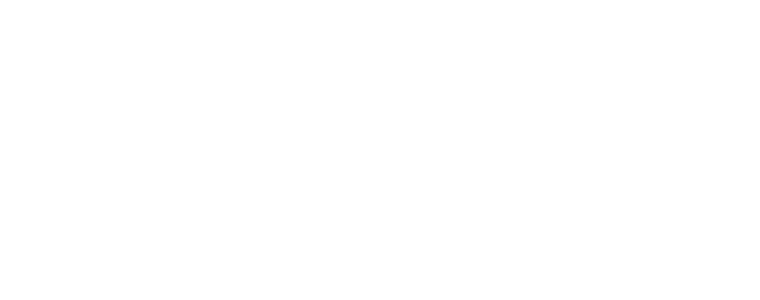

# Nonlinear dynamics and chaos

Code: [`chronoscopelab/analysis/nonlinear.py`](../../data-pipeline/chronoscopelab/analysis/nonlinear.py)
· Tests: [`tests/test_analysis_nonlinear.py`](../../tests/test_analysis_nonlinear.py)

## Deterministic chaos vs stochastic noise

A series can be irregular for two very different reasons: it is the output of a low-dimensional
**deterministic** (possibly chaotic) system, or it is genuinely **stochastic**. The distinction bounds
forecastability. A chaotic system is deterministic - in principle predictable - yet has a **finite prediction
horizon**: nearby trajectories diverge exponentially ($\sim e^{\lambda t}$), so forecast error grows and any
model degrades past a horizon set by the largest Lyapunov exponent $\lambda$. A stochastic series has no such
hidden determinism to exploit. This unit reconstructs the dynamics, quantifies them, and - critically - gates
every "it's chaotic" claim behind a surrogate test.

## Takens embedding: reconstructing the state space

We only observe one coordinate $x_t$ of what may be a multi-dimensional system. Takens' theorem (1981, DOI
[10.1007/BFb0091924](https://doi.org/10.1007/BFb0091924)) says that, generically, the time-delay vectors

$$v_t = \big[x_t,\; x_{t+\tau},\; x_{t+2\tau},\; \ldots,\; x_{t+(m-1)\tau}\big]$$

reconstruct an attractor diffeomorphic to the true one, for a suitable embedding dimension $m$ and delay
$\tau$. Every measure below is computed on this reconstruction.

## Correlation dimension and Lyapunov exponent

- **Correlation dimension** $D_2$ (Grassberger-Procaccia 1983, DOI
  [10.1016/0167-2789(83)90298-1](https://doi.org/10.1016/0167-2789(83)90298-1)) counts how the number of
  neighbor pairs within radius $r$ scales, $C(r) \propto r^{D_2}$. A low, non-integer $D_2$ suggests a
  low-dimensional (possibly strange) attractor.
- **Largest Lyapunov exponent** $\lambda_1$ (Rosenstein et al. 1993, DOI
  [10.1016/0167-2789(93)90009-P](https://doi.org/10.1016/0167-2789(93)90009-P)) measures the average
  exponential divergence of initially-nearby trajectories. $\lambda_1 > 0$ is the hallmark of sensitive
  dependence on initial conditions - the defining property of chaos.

## Recurrence plots and RQA

A **recurrence plot** marks $R(i,j) = 1$ when the reconstructed states $v_i, v_j$ are within a threshold
$\varepsilon$ (Eckmann, Kamphorst & Ruelle 1987, DOI
[10.1209/0295-5075/4/9/004](https://doi.org/10.1209/0295-5075/4/9/004)). Its texture is quantified by
**Recurrence Quantification Analysis** (Marwan et al. 2007, DOI
[10.1016/j.physrep.2006.11.001](https://doi.org/10.1016/j.physrep.2006.11.001)):

- **RR** (recurrence rate): the density of recurrence points (fixed here to a target so plots are comparable).
- **DET** (determinism): the fraction of recurrence points lying on **diagonal** lines - deterministic
  dynamics produce long diagonals, noise produces isolated points.
- **LAM** (laminarity): the fraction on **vertical** lines - intermittent / laminar states.
- **L_max**: the longest diagonal, inversely related to $\lambda_1$.

## The 0-1 test for chaos

The Gottwald-Melbourne 0-1 test (2004) drives $p_c(n) = \sum_j x_j \cos(jc)$, $q_c(n) = \sum_j x_j \sin(jc)$
for random phases $c$ and measures whether the mean-square displacement grows **linearly** (Brownian-like,
$K \approx 1$: chaos) or stays **bounded** ($K \approx 0$: regular). It needs no embedding or dimension
choice, which makes it a useful independent vote.

## The honesty gate: surrogate testing

**A low correlation dimension does not prove chaos.** Osborne & Provenzale (1989) showed that *colored noise*
- a purely stochastic process with a power-law spectrum - yields a finite, saturating $D_2$ that looks
attractor-like. So ChronoScope never declares chaos on $D_2$ (or even $\lambda_1$) alone. It runs a
**surrogate-data test** (Theiler et al. 1992, DOI
[10.1016/0167-2789(92)90102-S](https://doi.org/10.1016/0167-2789(92)90102-S)): **IAAFT** surrogates
(Schreiber & Schmitz 1996, DOI
[10.1103/PhysRevLett.77.635](https://doi.org/10.1103/PhysRevLett.77.635)) preserve the data's amplitude
distribution *and* power spectrum but destroy any nonlinear structure. If a nonlinear statistic on the data
falls outside the surrogate ensemble, the structure is genuinely nonlinear; if not, the "chaos" was an
artifact of the spectrum or the histogram. ChronoScope flags `likely_chaotic` **only** when $\lambda_1 > 0$
**and** the 0-1 test $K > 0.5$ **and** the surrogate test rejects linearity.

## What this is, and is NOT

- These measures are demanding: they need long, low-noise, roughly stationary series. On short or noisy
  data they are unreliable, and the report should be read together with the reliability context, not in
  isolation.
- A positive Lyapunov exponent bounds *how far* you can forecast; it does not mean "unforecastable" - short
  horizons can still be predictable, which is exactly what the forecasting ladder's per-horizon error curves
  show.
- Passing the surrogate gate establishes *nonlinearity*, which is necessary but not sufficient for chaos; the
  three-way vote (Lyapunov + 0-1 + surrogate) is deliberately conservative.

## Implementation notes

- Embedding, RQA (recurrence matrix, diagonal/vertical line statistics), the 0-1 test, and IAAFT surrogates
  are implemented directly (no heavy RQA dependency, which is awkward to build on Windows); correlation
  dimension and the largest Lyapunov exponent use `nolds`. The recurrence matrix is truncated (not
  subsampled) to keep the $O(n^2)$ computation tractable while preserving diagonal continuity.
- `nonlinear_report(x)` bakes: $D_2$, $\lambda_1$, the 0-1 $K$, the RQA quartet, the surrogate-test verdict,
  and the gated `likely_chaotic` flag with its explicit rule.

## References

- Takens, F. (1981). Detecting strange attractors in turbulence. *Lecture Notes in Mathematics* 898:366-381. DOI [10.1007/BFb0091924](https://doi.org/10.1007/BFb0091924).
- Grassberger, P. & Procaccia, I. (1983). Characterization of strange attractors. *Physica D* 9:189-208. DOI [10.1016/0167-2789(83)90298-1](https://doi.org/10.1016/0167-2789(83)90298-1).
- Rosenstein, M.T., Collins, J.J. & De Luca, C.J. (1993). A practical method for calculating largest Lyapunov exponents from small data sets. *Physica D* 65:117-134. DOI [10.1016/0167-2789(93)90009-P](https://doi.org/10.1016/0167-2789(93)90009-P).
- Eckmann, J.-P., Kamphorst, S.O. & Ruelle, D. (1987). Recurrence Plots of Dynamical Systems. *EPL* 4(9):973-977. DOI [10.1209/0295-5075/4/9/004](https://doi.org/10.1209/0295-5075/4/9/004).
- Marwan, N., Romano, M.C., Thiel, M. & Kurths, J. (2007). Recurrence plots for the analysis of complex systems. *Physics Reports* 438:237-329. DOI [10.1016/j.physrep.2006.11.001](https://doi.org/10.1016/j.physrep.2006.11.001).
- Gottwald, G.A. & Melbourne, I. (2004). A new test for chaos in deterministic systems. *Proc. R. Soc. A* 460:603-611. DOI [10.1098/rspa.2003.1183](https://doi.org/10.1098/rspa.2003.1183).
- Theiler, J., Eubank, S., Longtin, A., Galdrikian, B. & Farmer, J.D. (1992). Testing for nonlinearity in time series: the method of surrogate data. *Physica D* 58:77-94. DOI [10.1016/0167-2789(92)90102-S](https://doi.org/10.1016/0167-2789(92)90102-S).
- Schreiber, T. & Schmitz, A. (1996). Improved Surrogate Data for Nonlinearity Tests. *Phys. Rev. Lett.* 77:635-638. DOI [10.1103/PhysRevLett.77.635](https://doi.org/10.1103/PhysRevLett.77.635).
